# Seats Available, Come Study Here! #
Tiancheng Zhao, Hongrui Yu, Mingyang Cong, Lijing Tu

Video link:[link](https://vimeo.com/366579518)

## Introduction ##
This project is a pilot study of school studying space occupancy management system. It aims to detect the occupancy condition is a confined space. There are 2 parallel sensing systems were applied in this project. First, CO2  sensor is used to detect the indoor CO2 concentration. Because CO2 sensor always affected by time delay, PIR sensor and manual peopel counting were applied as a validation method. The second sensing system (PIR) detects the instance occupancy movement.
## Motivation ##
School library and department lounges are always packed with students. However, the seats are limited. Everyone has the experience that spend a lot of time in finding seats but still need to study at home. At that time, it would be great to have someone or something to tell us where we can find an available seat. This project is aiming to solve this problem using sensor to detect the occupancy condition and return the result to the user.
## Goals ##
The ultimate goal is to record the number of people studying in the library, train a model for predicting number of occupants and develop GUI for information sharing. When students install and run our GUI, they can know not only whether there are seats available but also how many seats are available. 

## Methodology ##
### Phenomena of Interest ###
#### Indoor carbon dioxide accumulation ####
As human activity consumes energy and emit carbon dioxide, when the emission rate is greater than room ventilation rate, carbon dioxide will accumulate in indoor environment. Assume the ventilation is generally steady and might fluctuate within small range, the accumulation rate, also carbon dioxide change rate, will be affected by number of occupants. Moreover, since emitted carbon dioxide volume is proportional to CO2 source – occupants in the room, CO2 concentration at a balanced level should also suggest number of occupants. 

#### Human Motion ####
Human consumes energy and generate heat, with radiating waves came at around 12 microns.[1] Since it falls within the range of 0.75 to 1000 micron of infrared radiation, human body could be seen as an infrared radiation source. Therefore, when someone moves around in a space, there should also be an infrared radiation moving in the space. Such phenomenon lays the ground for PIR motion sensor design.
In our case, when someone enters or exits the room, since it firstly went within sensor detection range and then left this range, motion of this infrared radiation source will be detected and recorded as number of occupants change. Connection between this phenomenon and sensor will be illustrated in “Sensors Used” section.

#### Static and Dynamic behavior ####
For human radiation detection, since human body temperature is always much above indoor environment temperature, even if body temperature changes with time, the fluctuations will not affect motion detection results, and therefore this phenomenon will be regarded as static. However, the dynamic characteristic of CO2 accumulation has been crucial in this project. It is just because of the change of accumulated CO2 level with time and differences of accumulation rate with various occupancy status that leads to the measuring the correlation between CO2 concentration and occupancy number. 
#### Signal characteristics ####
Outputs of PIR motion sensor are a high and low voltage outputs corresponding to motion detected and motion not detected scenarios respectively. For the PIR sensor used in this project, the high voltage output is 3.3 V. Also, it has been addressed in user manual that initial delay time is around 3, which means after a detection of human motion, a signal of low voltage will be sent out, and for the 3 seconds afterwards, there will be no high voltage sent out even if motion detected. However, since it is adjustable, we used the minimum delay time and were thus able to capture real-time detection. 

Nonetheless, this characteristic affects both data collection and processing. For data collection, based on this delay, we adjusted the sensor delay time to be smaller than sampling rate. In this way, we will have usually two consecutive, but sometimes only one “True” value signal showing number of occupants change.

As for numerical characteristic of PIR sensor, since there are only two output – high and low, the signal could actually be comprehended as a binary signal. Thus, signal processing techniques such as averaging filters or moving average could not be applied in this case.

## Sensors Used ##
### Passive infrared sensor (PIR Motion sensor) ###
#### Physical principles ####
The PIR motion sensor we selected is HC-SR501 infrared sensor which allows us to sense motion. Human bodies generate infrared heat which could be picked up by the PIR motion sensor. This sensor is made of a pyroelectric sensor which detects the level of infrared radiation, and a multifaceted lens (a Fresnel lens) which can enlarge the useful detection angle by improving the visibility of the smaller cones and decreasing the visibility of the intervening areas. [2]
#### Static and dynamic behavior ####
The maximum and minimum value of the physical variable that can be measured is from 4.5V to 20V and the output is 0V in low situation and 3.3V in high situation. The sensitivity ranges from 5s to 5 minutes.
Our sensor is an active sensor, in dynamic condition, as soon as the sensor detects a person’s moving, it outputs a 5V signal to the Raspberry Pi. And in static condition, when there is no person or person’s moving, the output is 0V.[2]
#### Sensor characteristics ####
Working voltage: 4.5V to 20V

Output: High: 3.3V, Low: 0V

Detection angle: Approximately 120 degrees

Range: Adjustable, up to 7m

Trigger modes: L unrepeatable trigger / H repeatable trigger (default)

Dwell time: (Stay-ON time) adjustable between 5-300 Seconds. –– it can be further increased by increasing the value of the CY1-Timing capacitor on pin 4 of the IC

Operating Temperature: -20 – +80 Degrees C.

PCB Dimensions: 33x25mm, 14mm High not including the Lens; Lens: 11mm high, 23mmDiameter.

Weight: 6g [2]
#### Applicability ####
This sensor could be used for outdoor lights, lift lobby and common staircases. Also, it could be used in shopping mall or used as garden lights.
#### Signal characteristics ####
When the sensor is triggered by person moving, there will be a 5V output being received by Raspberry Pi which gets high level voltage, then return “1”. When there is no detection of the body motion, Raspberry Pi GPIO output get low level voltage, then return “0”. However, there is still time delay which begins when motion is first detected, and the time delay will be reset by each detected motion. The Figure 1 shows the signal sketch for the PIR motion sensor.
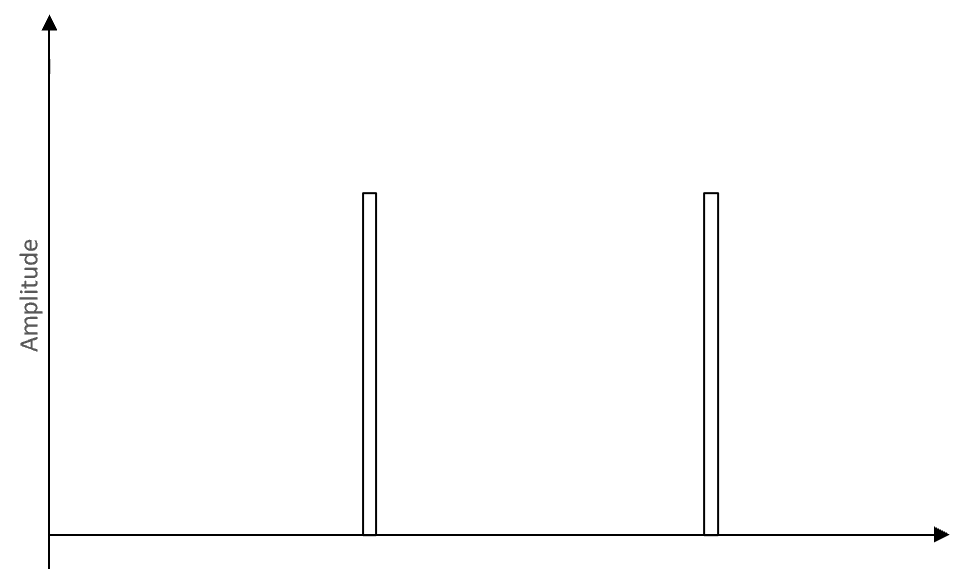

  <b>Figure 1 Signal sketch for the PIR motion sensor </b>

### Nondispersive Infrared (NDIR) CO2 Sensor ###
#### Physical principles ####
“Nondispersive infrared” is an industry term which used to detect carbon dioxide (CO2). An infrared (IR) lamp directs light waves through a tube containing an air sample to a filter in front of the IR light detector. The IR light passes through the optical filter is measured by the IR light detector. Then the difference is attained which is the result of the light being absorbed by the CO2 molecules in the air inside the tube.
#### Static and dynamic behavior ####
The detection range of the sensor is from 0 to 5000 ppm with a 0.4 to 2V linear output. And the sensitivity of this sensor is less than 30 seconds. 
The sensor response to the variable input is an excellent linear output when the input signals are constant with temperature compensation, that is, the higher the input, the higher the output voltage.
#### Sensor characteristics ####
Working voltage 4.5 V ~ 5.5V 

DC Average current < 85 mA 

Interface level 3.3 V 

Measuring range 0~5%VOL optional 

Output signal PWM UART 0.4-2V DC 

Preheat time 3min 

Response Time < 90s 

Working temperature 0℃ ~ 50℃ 

Working humidity 0~95%RH 

Weight 15 g 

Lifespan >5 year 

Dimension 57.5×34.7×16mm（L×W×H）[3]
#### Applicability ####
This sensor can be used for HVAC refrigeration equipment, fresh air system, air quality monitoring equipment, smart home, and schools.
#### Signal characteristics ####
When a beam of IR light is emitted by a source, the light does not “disperse” by substances between the light and a detector. If there are gases in the path, the light will be absorbed by the gases. As a result, the constant air input induces the constant linear output.
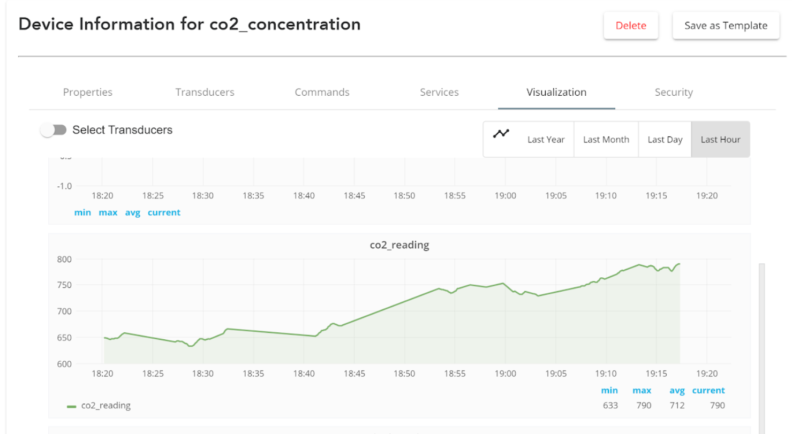

  <b>Figure 2 The visualization of CO2 sensor signal </b>

### Signal processing and conditioning ###
The PIR sensor was able to detect any objects passing by with temperature different from its ambient environment, generally, this will lead to noises and errors. Instead of condition signal after collection, a “proactive” measure was adopted to adjust delay time and sensing range before data collection. However, time delay would not be considered in data analysis.

There have been some online resources showing the necessity for eliminating DC voltage output as noise and amplify the AC output. [4]  However, after calibration and test, we decided such conditioning could be omitted for the PIR sensor used.  Also, we applied moving average with window length of 3 to prioritize the consecutive "True" binary discrete signals as a way balancing eleminating false positive errors and unintentionally filtering out true positive signals.

For CO2 sensor, signal output will be processed with mathematical equation and will read as indoor CO2 concentration in “ppm”. For the 1s sampling rate, since CO2 generation is a non-periodic continuous process, there should be no aliasing caused. However, according to Guillaume [5], the usual fluctuation of CO2 concentration variation should not be of concern in occupancy detection. To eliminate the effects from variations, we applied moving average also with window length of 3 for the collected CO2 concentration data.

## Experiments and Results ##
### Experiments ###
We used the inner room of CEE Graduate Suite (Wean Hall 3503) as the test field which has a ventilation and a relatively small volume. Then, we put our PIR sensor towards the door. When there is someone coming in or going out the room, the PIR sensor will detect the motion and be triggered. In order to avoid the impact of opening or closing the door on the concentration of CO2, the NDIR CO2 sensor was placed far away from the door with some shelters. 
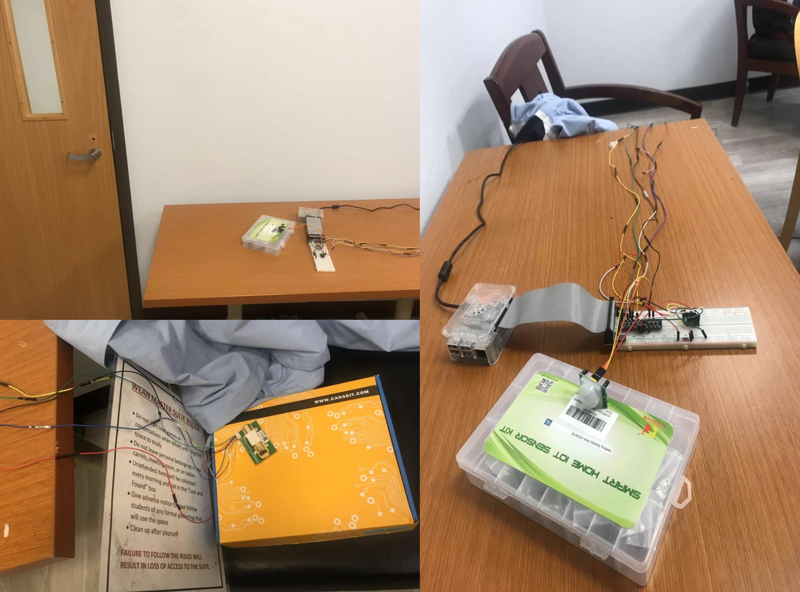

  <b>Figure 3 Experiment Circuit </b>

The maximum occupancy was set at five people. Then we used our equipment to detect the relationship between the indoor carbon dioxide changes and the number of people. The number of people was set to increase from one person to five persons with the growing mode is entering one person, two persons or three persons. And the departure mode is the same as the enter mode, until no one is in the room. We also designed a manual counting as the ground truth to check our results.
We repeated the same experimental steps for three days, more than 10 hours each day, and effectively predicted the number of people in the room based on the data we have obtained.
### Data Analysis ###
After we collect the data, we process the data before we analysis it. We use the moving average to process the CO2 concentration data to reduce the influence of noise during the measurement. The size of moving window is 5 data points. For the data from PIR and Ground-truth (actual number of students during the measurement), we don’t need to process them. As PIR generate binary data (0 or 1), there is no need to process it. While Ground-truth is the actual number of students during the measurement, we cannot process it because it is the data we refer to when we try to identify the pattern of CO2 level and PIR reading.

Firstly, we focus on identifying the pattern of PIR reading. As shown in Figure 5, PIR reading doesn’t match the ground-truth. Even though the PIR can record the time when people enter and leave the room, but there is also much noise that prevent us from tracking the right number of students in the test room. Besides, the PIR can only detect the motion instead of the direction of movement, it cannot tell us whether students are entering or leaving the room. Thus, we decide not to use PIR reading as an indicator.
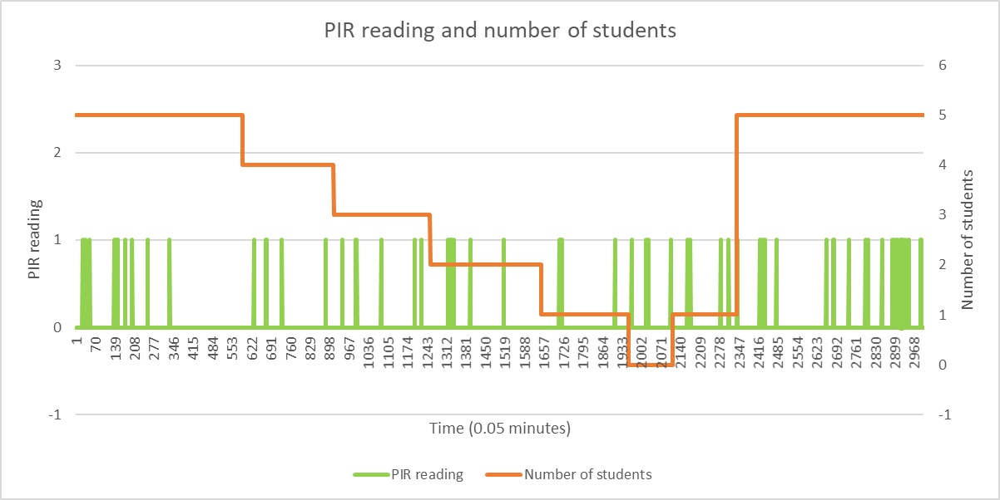

  <b>Figure 4 PIR reading and number of students </b>

Secondly, we focus on identifying the pattern of CO2 concentration. As shown in Figure 5, the change in CO2 concentration is tightly related to the change in number of students. At first, when there are 5 students in the test room, even the CO2 concentration fluctuates, but the average during that time period is maintained at 650 ppm. When students start to leave the room one by one, the decrease in CO2 concentration is approximately linearly related to the number of students leave the test room. When all students leave the room, the CO2 concentration fluctuates around 450 ppm. After a while, when 5 students enter the room together, the increase in CO2 concentration is approximately linearly related to the number of students enter the test room. According to this, we assume that the change in CO2 concentration is linearly related to the change in number of students, and decide to use linear regression to identify their relationship. Therefore, we control the number of students enter and leave the test room to discover the pattern of CO2 concentration.
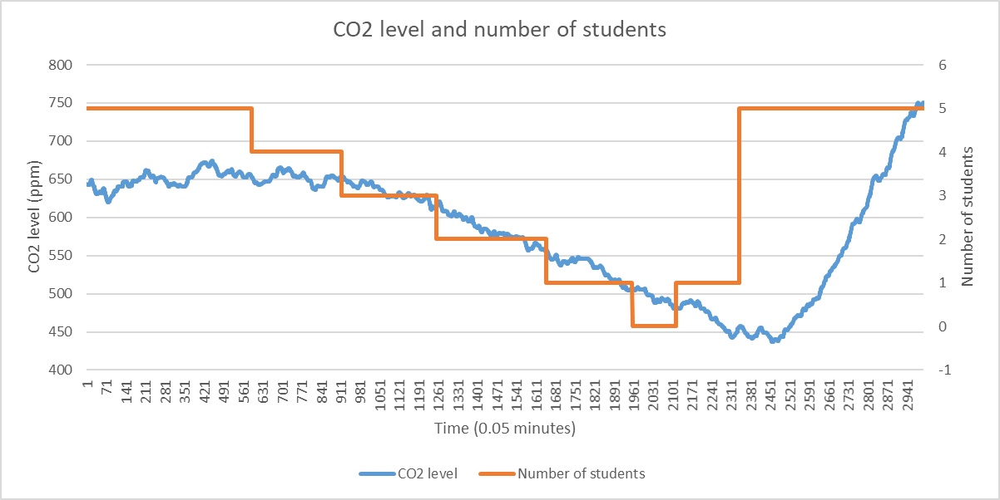

  <b>Figure 5 CO2 level and number of students </b>

After conducting linear regression on data regarding to different number of students entering the test room, we find that when students enter the room, the slope of regression line is approximately proportional related to the number of students, and the coefficient is somewhere between 0.14 and 0.15. As shown in Figure 6, the slope of regression line is 0.4305 when there are 3 students. As shown in Figure 7, the slope of regression line is 0.7118 when there are 5 students.

  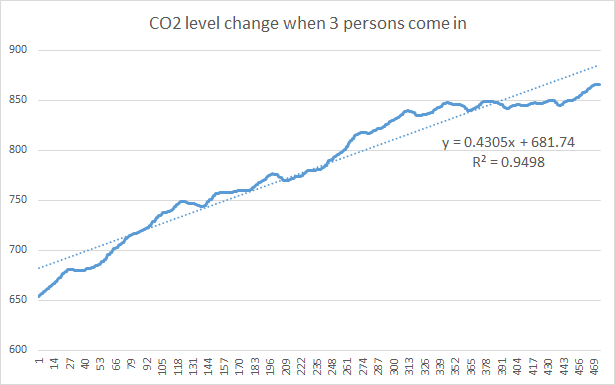

  <b>Figure 6  CO2 level change when 3 students enter the room </b>

  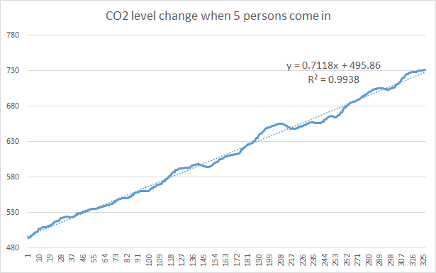

  <b>Figure 7  CO2 level change when 5 students enter the room </b>

Then, we conduct linear regression on data regarding to different number of students leaving the test room. The result is confusing because in the short period of time (about 3 minutes), the slope of regression line is approximately proportional related to the number of students, while in the long period of time, the slope of regression line is somewhere near -0.15.

As shown in Figure 8, 9 and 10, the slope of regression line in short period of time is -0.148 for 1 student, -0.2817 for 2 students and -0.452 for 3 students. The coefficient is somewhere between -0.14 and -0.15, though the confidence level is not high enough to achieve a solid conclusion.

  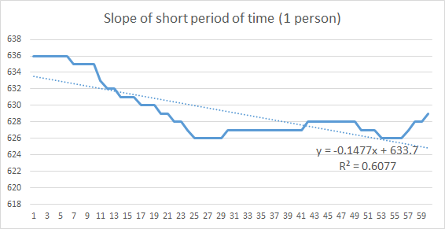

  <b>Figure 8  Slope in short period of time (1 student) </b>

  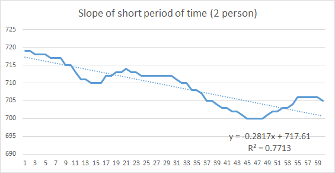

  <b>Figure 9  Slope in short period of time (2 students) </b>

  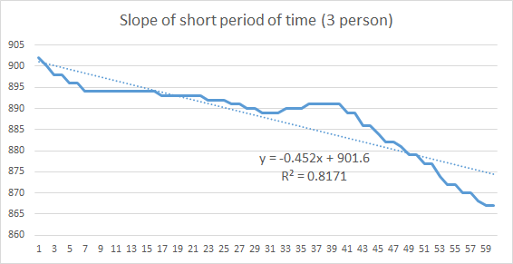

  <b>Figure 10  Slope in short period of time (3 student) </b>

However, for long period of time, even the confidence level is very high, the slope of regression line is close to -0.145 regardless of the number of students. As shown in Figure 11, 12 and 13.

  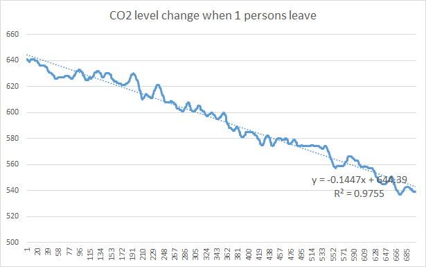

  <b>Figure 11  Slope in long period of time (1 student) </b>

  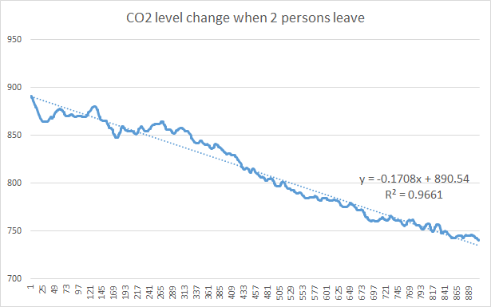

  <b>Figure 12  Slope in long period of time (2 students) </b>

  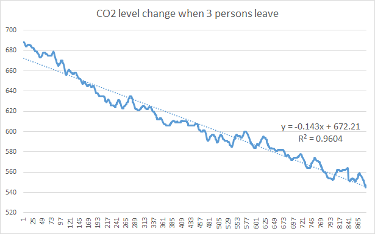

  <b>Figure 13  Slope in long period of time (3 student) </b>

This causes some trouble in estimating the number of students in the test room, as the linear relationship no longer exists when time period is too long, while the CO2 concentration fluctuates and error rate increases when time period is too short. 

Thirdly, aside from identifying the trend of CO2 concentration, we also need to define a baseline, which is the current CO2 concentration, to estimate the number of students. Unfortunately, as we don’t have control over the ventilation system in the test room, the baseline varies every day. However, the contribution to CO2 concentration for each student is similar and each students can contribute 80 ppm after CO2 concentration stabilizes. Thus, we can measure the CO2 concentration every morning and set value from that measurement as the baseline.

Finally, we get the estimation function: Estimation = Base + Trend. We use 200 data points (10 minutes from now) to do linear regression to find the trend of current CO2 level. In short period of time, the CO2 fluctuation can be large, which will seriously impair the accuracy of estimation when students enter the room. Thus, we choose a relatively long time period to ensure the accuracy of estimation when students enter the room, and meanwhile to reduce the error rate when students leave the room. Furthermore, in order to reduce overall error rate, we use the mean of two consecutive categories as boundary to distinguish these two consecutive categories.
The code regarding to estimation is shown as in Figure 14. 

  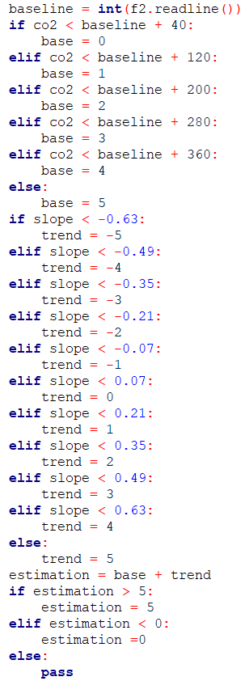

  <b>Figure 14  Estimation logic </b>

## IoT application with Open Chirp ##
We also encourage the use of online resources displaying real-time CO2 concentration. Though the daily baseline concentration changes with ventilation rate, there are still two extreme cases that are easily observable from Open Chirp. One is the extreme low CO2 reading at 400-500 ppm which suggests an empty room. Another one is extreme high CO2 concentration more than 850 ppm which usually suggests a full name. It has been observed, however, that at weekday afternoon with weak ventilation, room with only 3 people could also have that high level. But if the room has that high level concentration, it will not be suggested to stay in anyway.

### Open Chirp: [link](https://openchirp.io/home/device/5da25be6466cc60c381e0c97#visualization) 

## Discusion ##
1. The schedule of ventilation rate, which determines CO2 concentration balance,has an unknown schedule. After analyzing data collected from Sunday to Wednesday, we decided the concentration for the same number of occupants could vary for weekdays and weekend. Since we don’t have control over the ventilation system of the test room, nor even knowing its schedule, it could be hard to have a uniform regression model applicable for every day. Our solution to this phenomenon has been using a daily measured “base” level concentration as the indication of daily ventilation rate and determines the number of occupants by change rate of CO2 concentration, as introduced in the last section.

2. The activity level of students in the test room will influence the amount of CO2 discharged by students. It has been observed that CO2 concentration level for occupants doing manufacturing work, or being actively discussing homework, would be rather different from that in a quiet study room. In final application GUI design, we only use the model trained with quiet studying students. If having chances to further improve the project, this will be one of our targets.

3. The fluctuation of slope in short period of time will influence the accuracy of the estimation. When students leave the room, the slope of regression line is approximately proportional to the number of students only in short period of time, while the slope converges to -0.15 in long period of time. In order to reduce the error rate, we use the relative short time period to compute the trend of CO2concentration. However, the influence from fluctuation of slope increases as the duration of time period decreases.

4. Indoor air movement will influence the CO2 reading, so it’s important to put CO2 sensor at the place with minor air movement.

5. The delay in response of CO2 sensor makes it impossible to make real-time estimation.

### Progress Report: [link](old.html)

### Data Link: [link](https://drive.google.com/drive/folders/1QOsrEhKQrV2rD2h2O9pl9yumLGybT-2e?usp=sharing)

### Reference
[1] https://www.hko.gov.hk/education/edu02rga/radiation/radiation_02-e.htm

[2] http://kookye.com/2018/11/06/arduino-lesson-pir-motion-sensor/

[3] https://www.winsen-sensor.com/d/files/infrared-gas-sensor/mh-z14a_co2-manual-v1_01.pdf

[4] Ansanay-Alex, G. (2013). Estimating occupancy using indoor carbon dioxide concentrations only in an office building: a method and qualitative assessment. 11th REHVA World Congr. Energy Eff., Smart Healthy Build.

[5] https://www.st.com/content/ccc/resource/technical/document/application_note/b8/84/29/41/21/00/44/41/DM00096551.pdf/files/DM00096551.pdf/jcr:content/translations/en.DM00096551.pdf

